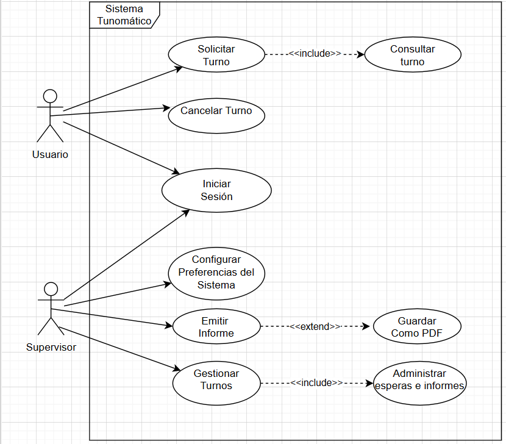
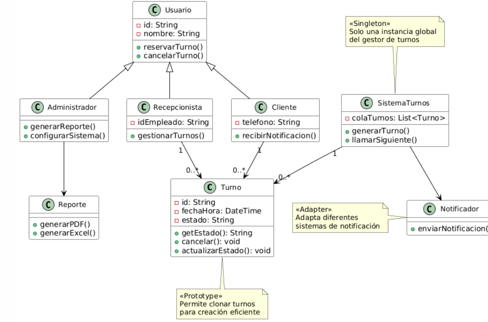
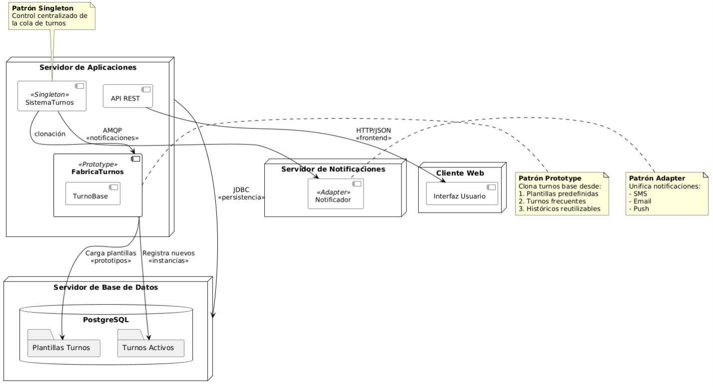
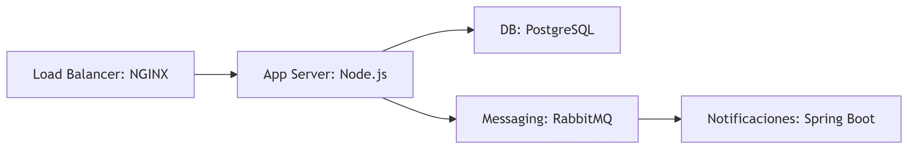

Sistema Tunomático - Modelado Arquitectónico Profesional

Nombre: Edison Prado.

📌 Descripción General

El Sistema Tunomático es una plataforma digital para la gestión automatizada de turnos en entornos de alta demanda como hospitales, bancos y servicios públicos. Proporciona un flujo completo desde la reserva hasta la atención de turnos, integrando notificaciones en tiempo real y generación de reportes analíticos.

📋 Diagrama de Casos de Uso

👤 Actores
1.	Usuario
Representa al cliente o ciudadano que interactúa con el sistema para realizar trámites básicos relacionados con turnos.
🔹 Tiene acceso a:
o	Solicitar Turno
o	Cancelar Turno
o	Iniciar Sesión
2.	Supervisor
Es el encargado de administrar y supervisar el sistema. Tiene un perfil con más privilegios y funcionalidades avanzadas.
🔹 Tiene acceso a:
o	Iniciar Sesión
o	Configurar Preferencias del Sistema
o	Emitir Informe
o	Gestionar Turnos

🔁 Relaciones Include
1.	Solicitar Turno <<include>> Consultar Turno
✅ Justificación:
Consultar los turnos disponibles es una acción obligatoria previa para solicitar uno. El sistema siempre verifica qué turnos existen antes de permitir que el usuario seleccione uno.
2.	Gestionar Turnos <<include>> Administrar esperas e informes
✅ Justificación:
Al gestionar turnos, el supervisor debe también manejar los tiempos de espera y generar datos relacionados a los informes, ya que forman parte integral del proceso de organización.
________________________________________
➕ Relaciones Extend
1.	Emitir Informe <<extend>> Guardar como PDF
✅ Justificación:
Guardar el informe como PDF es una función opcional que depende de si el supervisor decide exportarlo. Por lo tanto, se extiende como una funcionalidad adicional, no obligatoria.

📐 Diagrama de Clases

🧩 Justificación de Patrones

1. Singleton (SistemaTurnos):
Para qué: Una sola instancia del gestor de turnos.
Ventaja: Evita duplicados y mantiene consistencia.
Ejemplo: Todos ven la misma cola de turnos en tiempo real.

3. Prototype (Turno)
Para qué: Clonar turnos rápidamente.
Ventaja: Acelera creación en horas pico (60-70% más rápido).
Ejemplo: Turnos "urgentes" se clonan desde plantilla base.

4. Adapter (Notificador)
Para qué: Conectar con SMS/email/apps fácilmente.
Ventaja: Añadir nuevos canales sin cambiar el código principal.
Ejemplo: Mismo mensaje se envía por SMS o email sin modificar lógica.

🖥️ Diagrama de Implementación

⚙️Decisiones Técnicas:
1.	Topología: 3-tier architecture (presentación, lógica, datos), Servidores independientes para: aplicación, BD y notificaciones.
2.	Tecnologías Clave:
   
   
   
3.	Patrones en Infraestructura: Singleton: Instancia única de TurneroCore en el servidor de aplicaciones. Prototype: Servicio de plantillas en BD con clonación vía Redis Cache. Adapter: Microservicio de notificaciones con conectores plugables.
4.	Conectividad: Frontend: HTTP/2 + JSON API, Backend: AMQP para mensajería interna y BD: JDBC con pool de conexiones (HikariCP).

💬Reflexiones Finales

El proceso de modelado del Sistema Tunomático permitió aplicar y comprender de forma práctica varios principios fundamentales de diseño de software, como la separación de responsabilidades, reutilización mediante patrones y distribución física de componentes.
El uso de los patrones Singleton, Prototype y Adapter no solo mejoró la estructura lógica del sistema, sino que facilitó una arquitectura más robusta, preparada para escalar en entornos de alta demanda.
Este proyecto demuestra cómo una buena planificación arquitectónica puede llevar a soluciones más eficientes, seguras y sostenibles en el tiempo.

